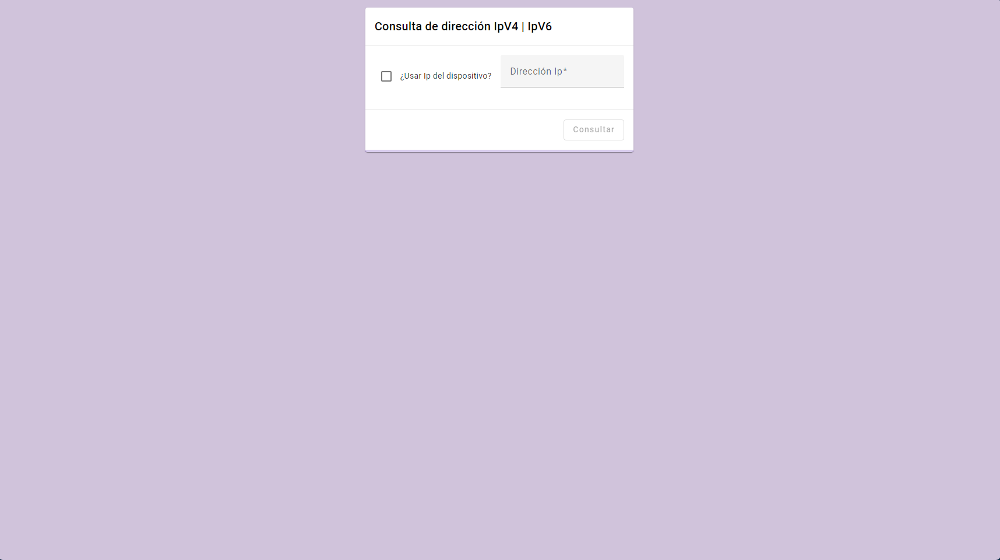
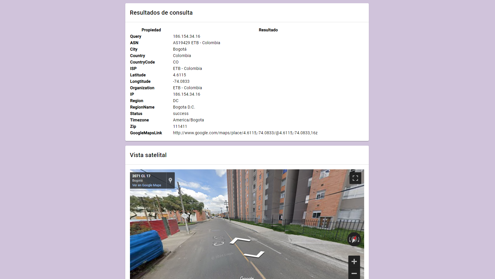
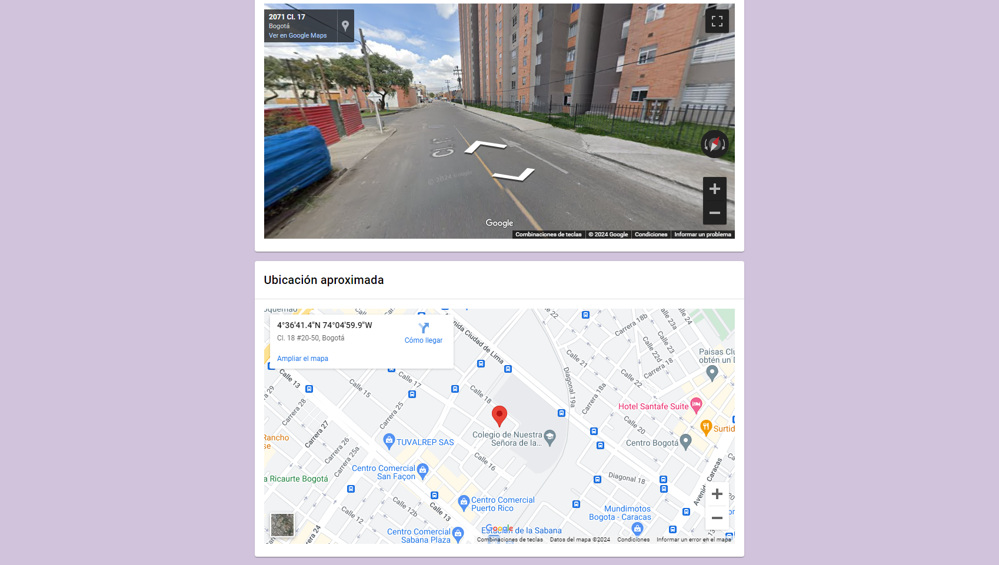
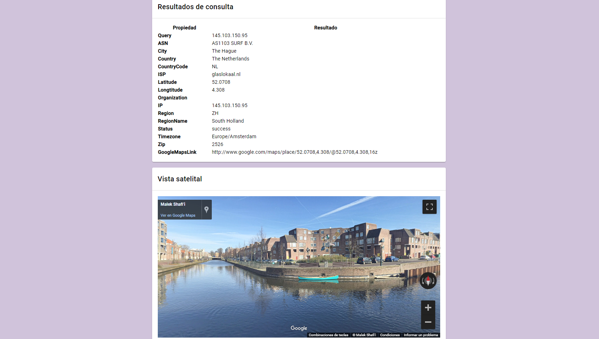
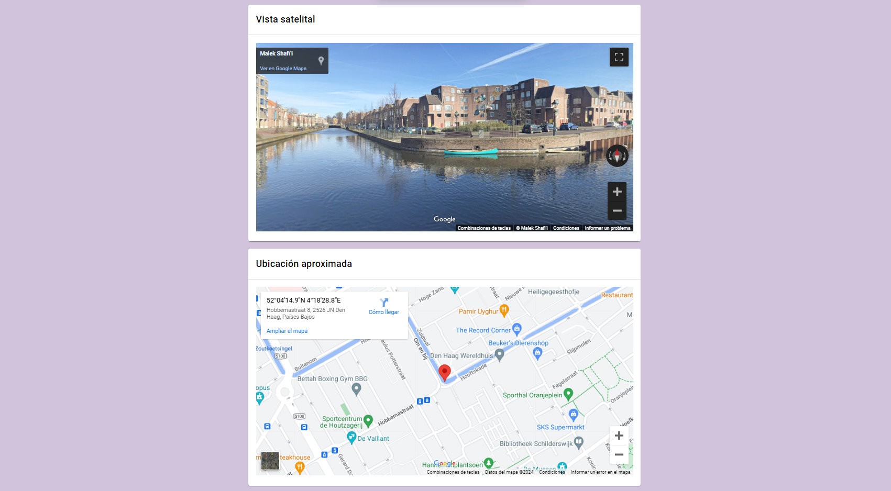

# Proyecto final redes de comunicaciones III

Miguel Ángel Rico García - 20191020107

## Funcionamiento

El aplicativo permite realizar consultas con base a una dirección IP, retornando información específica como la siguiente:

* Número de sistema autónomo ASN
* Ciudad
* País
* Código de país
* Proveedor de servicios de internet ISP
* Latitud
* Longitud
* Código Zip

Adicionalmente a esto, se tendrán mapas aéreos y de visualización por calles generados con la latitud y la longitud de la respuesta de la consulta, esto haciendo uso del API de Google Maps.

### Nota

El aplicativo puede realizar consultas con base a la dirección del dispositivo desde donde se acceda al mismo, o en caso contrario, con una dirección Ipv4 o Ipv6 propia.

## Capturas del aplicativo

### Utilizando la dirección propia del dispositivo

### Utilizando una dirección Ipv4 propia

