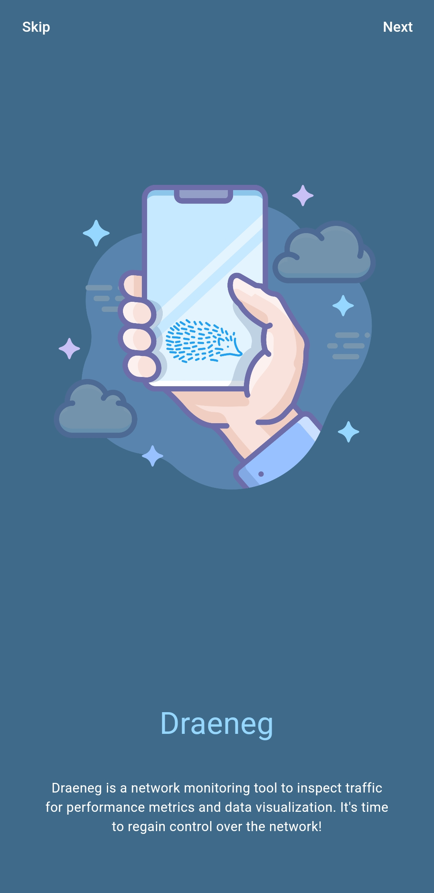
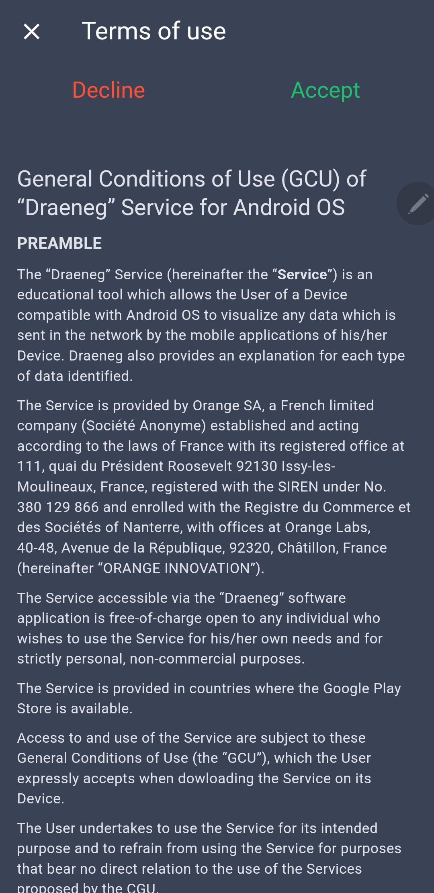
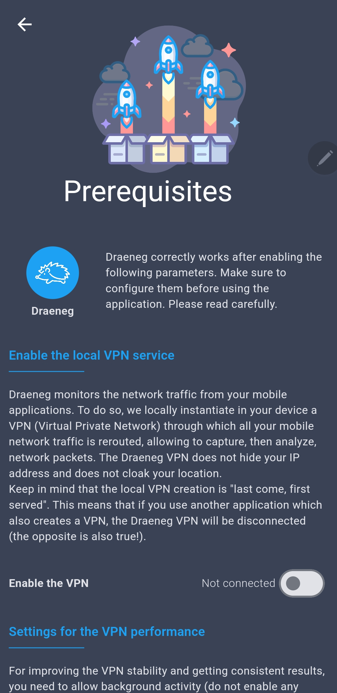
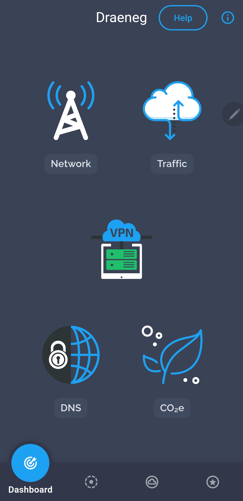
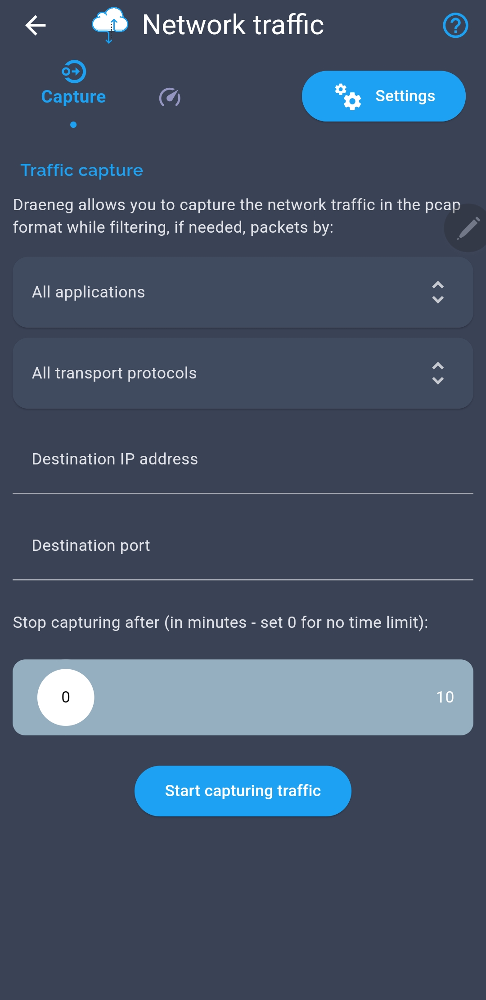
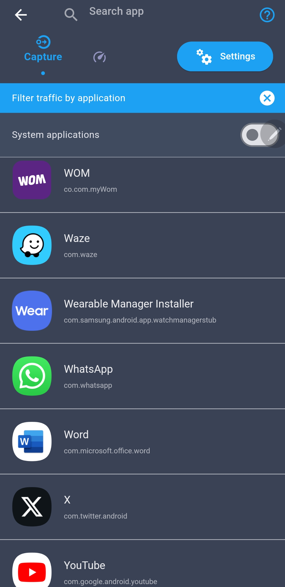
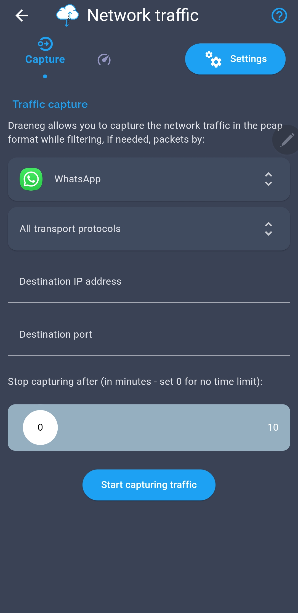
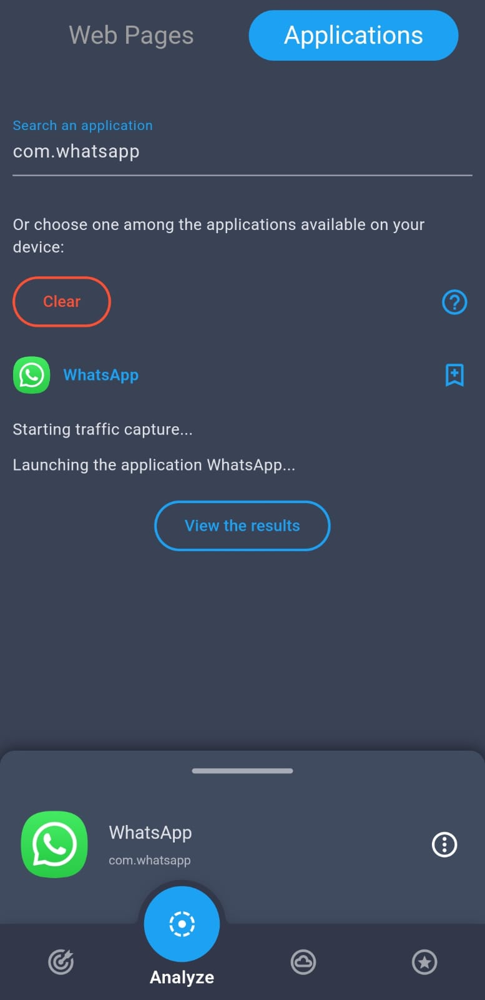
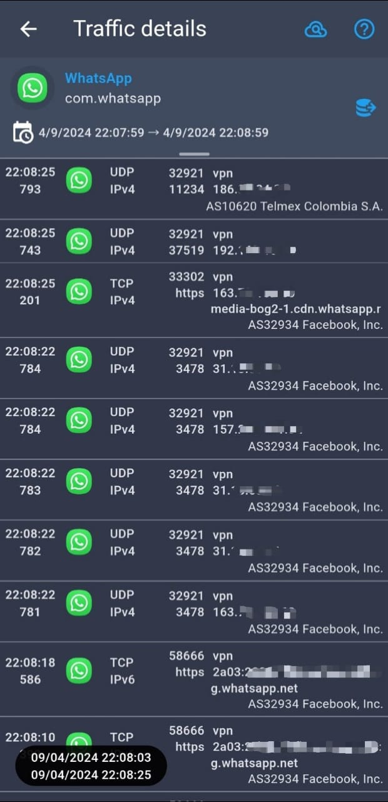

# Proyecto final redes de comunicaciones III

Miguel Ángel Rico García - 20191020107

## Aplicativo DRAENEG

### Funcionamiento

Draeneg es una herramienta desarrollada por el proveedor de Internet Orange que permite descubrir el uso que le dan a Internet las aplicaciones móviles.

Con esta herramienta se podrá monitorear el tráfico de red por aplicación, protocolo, dirección IP y hasta dominio DNS; existe también la opción de capturar en varios formatos el tráfico de red por si se quisiera realizar un análisis más exhaustivo como con Wireshark.

### Instalación y funcionamiento

1. Instalar el aplicativo (Disponible en la app store únicamente)

2. Al abrir el aplicativo por primera vez se realizarán los siguientes pasos:

2.1 Tocar en 'skip'

2.2 Aceptamos términos y condiciones

2.3 Tocar en 'Configure now' y habilitar permisos relacionados a VPN

2.4 Volvemos a la pantalla principal y tocamos en 'Traffic'

2.5 En esta pantalla capturaremos todo el tráfico de red de las aplicaciones del celular, para nuestro caso en particular filtraremos el tráfico para el aplicativo Whatsapp tocando en 'All applications' y buscándolo en la lista

2.6 Con estas configuraciones se puede comenzar a rastrear el tráfico del aplicativo, como lo pueden ser llamadas, obteniendo así la dirección IpV4 del emisor de estas

